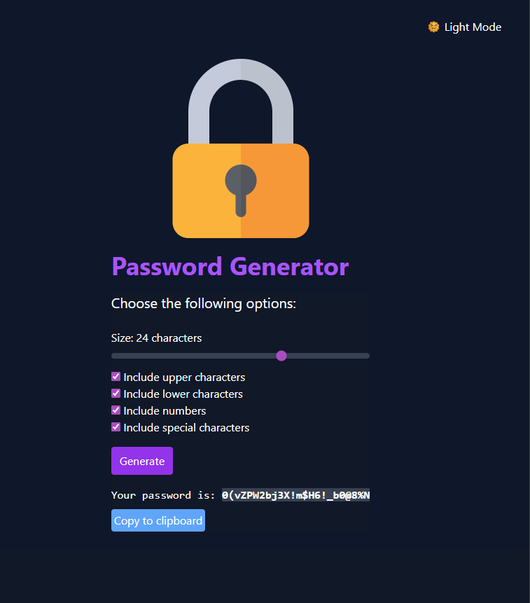

# Password Generator App

This is a simple and customizable password generator built with React and Vite. The application allows users to generate secure passwords based on selected criteria, such as:

- Password length (8 to 32 characters)
- Inclusion of uppercase letters
- Inclusion of lowercase letters
- Inclusion of numbers
- Inclusion of special symbols

## Features

- Real-time password generation based on user-selected options
- Copy generated password to clipboard with one click
- Responsive and modern UI with dark mode support

## How it works

1. Select your desired password options (length, character types).
2. Click the **Generate** button to create a new password.
3. Copy the generated password using the **Copy to clipboard** button.

## Screenshot



## Getting Started

1. Install dependencies:
	```bash
	npm install
	```
2. Start the development server:
	```bash
	npm run dev
	```
3. Open your browser at [http://localhost:5173](http://localhost:5173)

---
Built with React, Vite, and Tailwind CSS.
